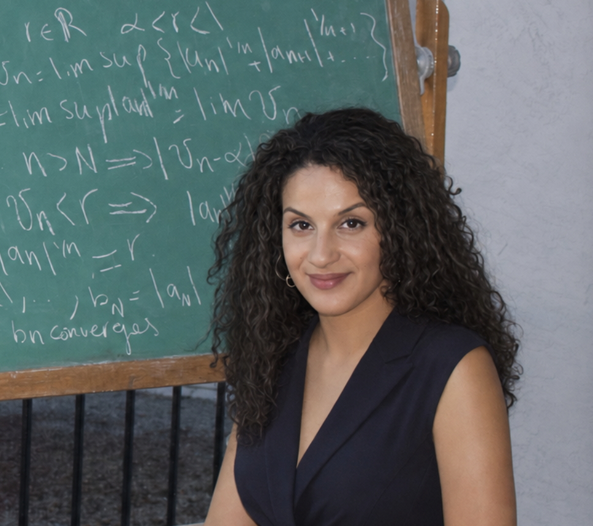

<!DOCTYPE html>
<html lang="en">
<head>
    <meta charset="UTF-8">
    <meta name="viewport" content="width=device-width, initial-scale=1.0">
    <title>Yousra Al-Idrisi | Academic & Education Portfolio</title>
    
</head>
<body>

    <header>
        

            <a href="#" class="site-title">Yousra Al-Idrisi</a>
            <nav>
                <a href="#about">About</a>
                <a href="#research">Research</a>
                <a href="#teaching">Teaching</a>
                <a href="#academy">Academy</a>
            </nav>
        

    </header>

    <main>
        

            

                <h1>Yousra Al-Idrisi</h1>
                
Pure Mathematician & Educator

                

                    I hold an M.A. in Mathematics from the <strong>University of California, Santa Cruz</strong> and a B.A. in Mathematics from the <strong>University of California, Berkeley</strong>.
                

                

                    My academic work focuses on geometric group theory, low-dimensional topology, and non-positive curvature geometry. Beyond research, I am dedicated to university mathematics education, course curriculum development, and 1:1 private instruction through <strong>Math With Yousra Academy</strong>.
                

                <ul class="links-list">
                    <li><strong>Email:</strong> <a href="mailto:mathwithyousra.academy@gmail.com">mathwithyousra.academy@gmail.com</a></li>
                    <li><strong>Curriculum Vitae:</strong> <a href="CV.pdf" target="_blank">Download CV (PDF)</a></li>
                    <li><strong>LinkedIn:</strong> <a href="https://www.linkedin.com/in/yousra-al-idrisi-14950a316/" target="_blank">linkedin.com/in/yousra-al-idrisi</a></li>
                </ul>
            

            

                
            

        

        <section id="research">
            <h2>Research Interests & Thesis</h2>
            

                <strong>Research Interests:</strong> Geometric group theory and low-dimensional topology, including non-positive curvature, hyperbolic manifolds, Artin and Coxeter groups, random groups, and knot/link invariants.
            

            

                

                    Master's Thesis: Geometry of Nonpositive Curvature and the Flat Subspace Theorem
                    2025 – 2026
                

                
University of California, Santa Cruz (Advisor: Jiayin Pan)

                <ul class="details">
                    <li>Developed a self-contained proof of the Gromoll–Wolf Flat Subspace Theorem for solvable groups acting on nonpositively curved spaces.</li>
                    <li>Constructed comparison geometry foundations including Rauch's comparison theorem, Cartan–Hadamard theorem, and geodesic rigidity bounds.</li>
                </ul>
            

        </section>

        <section id="teaching">
            <h2>Teaching & Academic Mentorship</h2>
            

                

                    Teaching Assistant
                    Sep 2022 – Present
                

                
University of California, Santa Cruz

                <ul class="details">
                    <li><strong>Courses Taught:</strong> MATH 23B (Vector Calculus II), MATH 23A (Vector Calculus I), MATH 21 (Linear Algebra), MATH 19B (Calculus for STEM), MATH 16B (Calculus for Life Sciences), MATH 11A/B, MATH 3 (Precalculus).</li>
                    <li>Designed original quizzes, practice exams, problem sets, and discussion activities aimed at strengthening conceptual rigor and addressing student misconceptions.</li>
                </ul>
            

        </section>

        <section id="academy">
            <h2>Math With Yousra Academy</h2>
            

                Providing high-yield, university-aligned instruction and specialized private tutoring for advanced secondary and university students.
            

            

                

                    <h3>1:1 Private Instruction</h3>
                    
Tailored coaching in AP Calculus AB/BC, Multivariable Calculus, Linear Algebra, Differential Equations, and Introduction to Proofs.

                    In-Person & Remote
                

                

                    <h3>Curriculum & Courseware</h3>
                    
Canvas-structured online video modules, exam preparation guides, and structured mathematical problem sets built from university standards.

                    Academy Platform
                

            

        </section>

    </main>

    <footer>
        &copy; Yousra Al-Idrisi. All rights reserved.
    </footer>

</body>
</html>
